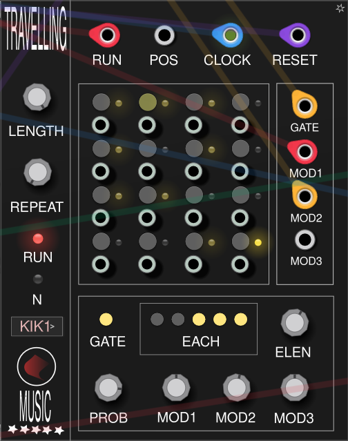

# Hardseqs

Best 16-step sequencer ever made for the good people.

# Overview



Hardseqs is a versatile and powerful module designed for VCV Rack, enabling users to create intricate sequences with customizable parameters for each step. This module allows for detailed control over gate signals, modulation outputs, and step repetition, making it an essential tool for any modular synthesist.

# Features

- **16 Steps**: Configure parameters for each of the 16 steps in the sequence.
  
- **Gate Configuration**: Each step can be assigned a gate state (GATE button).

- **Modulation Outputs**: Each step features three modulation outputs (mod1, mod2, mod3) that can be configured independently.

- **Repeat Mode**: Customize the repeat behavior for each step using the ELEN and EACH buttons. This allows for complex patterns, such as playing a gate signal for a specified number of iterations before skipping steps. Like skip two iterations and play on third as shown on picture above (ELEN=3).

- **Probability Control**: Each step includes a PROP parameter that allows users to set the probability of that step being triggered, adding an element of randomness to the sequence.

- **Trigger Outputs**: Each step has its own dedicated trigger output, providing flexibility in routing and modulation.

- **Start Position Modulation**: The sequencer's start position can be modulated via the POS input, allowing for dynamic changes in the sequence playback. 0V passed = first step, 5V = to 16-th step.

- **Global Repeat Parameter**: Set a REPEAT parameter for the entire sequencer, enabling the sequence to play a specified number of times before stopping automatically.

# Youtube guide

TODO

# How-to build&install

```
export RACK_DIR=<path_to_racksdk>
make

Then copy `plugin.so` , `plugin.json` , `/res` to `/home/user/.local/share/Rack2/plugins.../HardSeqs` or another folder containing your Rack2 application.
```

